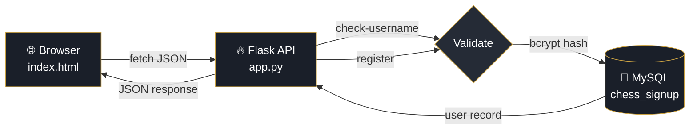

<div align="center">


<a href="https://github.com/yourusername/chess-signup">
  
</a>

<br/>


<br/>


<br/><br/>

```
        ♔ ♕ ♖ ♗ ♘ ♙
   Welcome to the Board
        ♟ ♞ ♝ ♜ ♛ ♚
```

</div>

---

##  About The Project

**Chess Signup** is a polished, full-stack authentication system designed for a chess-themed platform. It features a **dark, regal UI** with the signature gold-on-charcoal aesthetic of grandmaster tournaments, paired with a hardened Flask backend that guards user credentials with **bcrypt hashing**, **server-side validation**, and **real-time username availability checks**.

> *“Every pawn dreams of becoming a queen — this is where the journey begins.”*

<div align="center">

### ✨ Preview


*Replace the URL above with your own screenshot or GIF demo.*

</div>

---

##  Features

<table>
  <tr>
    <td width="50%">

#### ♟️ Frontend
- 🎨 **Dark, regal UI** with gold accents (`#cca343`)
- ⚡ **Real-time username** availability check (debounced)
- 🔍 **Inline field validation** with friendly error messages
- 🎭 **Animated success overlay** on registration
- 📱 **Fully responsive** — looks great on mobile & desktop
- 🍞 **Toast notifications** for server errors

</td>
    <td width="50%">

#### ♛ Backend
- 🔒 **bcrypt password hashing** (industry standard)
- ✅ **Dual-layer validation** (client + server)
- 🛡️ **SQL injection safe** (parameterized queries)
- 🌐 **CORS enabled** for cross-origin clients
- 📧 **Email & username uniqueness** enforced
- 🩺 **Health-check endpoint** for monitoring

</td>
  </tr>
</table>

---

##  Tech Stack

<div align="center">

| Layer | Technology |
|:--:|:--:|
| **Frontend** | HTML5 · Tailwind CSS (CDN) · Vanilla JavaScript · Inter font |
| **Backend** | Python 3.8+ · Flask · Flask-CORS |
| **Database** | MySQL 8.0 (utf8mb4) |
| **Security** | bcrypt · python-dotenv · regex validation |
| **Driver** | `mysql-connector-python` |

</div>

---

##  Architecture



---

##  Project Structure

```
chess-signup/
│
├── 📄 app.py              # Flask backend (API endpoints)
├── 📄 index.html          # Signup page UI
├── 📄 database.sql        # Database schema
├── 📄 requirements.txt    # Python dependencies
├── 📄 .env                # Environment variables (you create this)
├── 📄 .gitignore
└── 📄 README.md           # You're reading it ♟️
```

---

##  Quick Start

### 📋 Prerequisites

Make sure you have these installed:

```bash
✅ Python 3.8 or higher
✅ MySQL 8.0+ (running locally)
✅ pip (Python package manager)
✅ A modern web browser
```

### 🛠️ Installation

<details open>
<summary><b>Step 1 — Clone the repository</b></summary>

```bash
git clone https://github.com/yourusername/chess-signup.git
cd chess-signup
```
</details>

<details open>
<summary><b>Step 2 — Set up a virtual environment (recommended)</b></summary>

```bash
# Create venv
python -m venv venv

# Activate it
# 🪟 Windows:
venv\Scripts\activate
# 🐧 macOS / Linux:
source venv/bin/activate
```
</details>

<details open>
<summary><b>Step 3 — Install Python dependencies</b></summary>

```bash
pip install flask flask-cors mysql-connector-python bcrypt python-dotenv
```

Or, if you have a `requirements.txt`:
```bash
pip install -r requirements.txt
```
</details>

<details open>
<summary><b>Step 4 — Set up the MySQL database</b></summary>

Run the provided SQL script once:

```bash
mysql -u root -p < database.sql
mysql -u root -p chess_db < scripts/puzzles.sql
```

This creates the `chess_signup` database and the `users` table.
</details>

<details open>
<summary><b>Step 5 — Configure environment variables</b></summary>

Create a `.env` file in the project root:

```env
DB_HOST=localhost
DB_USER=root
DB_PASSWORD=your_mysql_password_here
DB_NAME=chess_signup
```

> ⚠️ **Never commit your `.env` file.** Add it to `.gitignore`.
</details>

<details open>
<summary><b>Step 6 — Run the Flask backend</b></summary>

```bash
python app.py
```

You should see:
```
* Running on http://127.0.0.1:5000
```
</details>

<details open>
<summary><b>Step 7 — Open the frontend</b></summary>

Simply double-click `index.html`, or serve it locally:

```bash
# Quick static server (Python 3)
python -m http.server 8080
```

Then visit **http://localhost:8080** in your browser. ♟️
</details>

---

##  API Reference

The Flask backend exposes **three endpoints**, all returning JSON.

### 🩺 `GET /api/health`

Confirms the API and database are reachable.

**Response — `200 OK`**
```json
{ "status": "ok", "database": "connected" }
```

---

### 🔍 `GET /api/check-username?username=<name>`

Live availability check, called as the user types.

**Query parameter:** `username` *(string)*

**Response — `200 OK`**
```json
{ "available": true, "message": "Username available!" }
```
```json
{ "available": false, "message": "Username already taken" }
```

---

### 📝 `POST /api/register`

Creates a new user account.

**Request body**
```json
{
  "email": "magnus@chess.com",
  "username": "magnus_c",
  "password": "knight_to_e4",
  "confirm_password": "knight_to_e4",
  "agreed": true
}
```

**Success — `201 Created`**
```json
{
  "success": true,
  "message": "Account created successfully! Welcome to the board.",
  "user_id": 42,
  "username": "magnus_c"
}
```

**Validation failure — `400 Bad Request`**
```json
{
  "success": false,
  "errors": {
    "email": "Invalid email format",
    "password": "Password must be at least 8 characters"
  }
}
```

**Conflict — `409 Conflict`**
```json
{
  "success": false,
  "errors": { "username": "Username already taken" }
}
```

---

##  Database Schema

```sql
CREATE DATABASE IF NOT EXISTS chess_signup
    CHARACTER SET utf8mb4
    COLLATE utf8mb4_unicode_ci;

USE chess_signup;

CREATE TABLE IF NOT EXISTS users (
    id             INT AUTO_INCREMENT PRIMARY KEY,
    email          VARCHAR(255) NOT NULL UNIQUE,
    username       VARCHAR(20)  NOT NULL UNIQUE,
    password_hash  VARCHAR(255) NOT NULL,
    created_at     TIMESTAMP    DEFAULT CURRENT_TIMESTAMP,
    INDEX idx_email    (email),
    INDEX idx_username (username)
);
```

| Column | Type | Notes |
|---|---|---|
| `id` | `INT` | Auto-incrementing primary key |
| `email` | `VARCHAR(255)` | Unique, indexed |
| `username` | `VARCHAR(20)` | Unique, indexed, 3–20 chars |
| `password_hash` | `VARCHAR(255)` | bcrypt hash (never plain text) |
| `created_at` | `TIMESTAMP` | Auto-set on insert |

---

##  Validation Rules

<table>
<tr><th>Field</th><th>Rule</th><th>Pattern</th></tr>
<tr><td><b>Email</b></td><td>Standard email format</td><td><code>^[\w.%+\-]+@[\w.\-]+\.[A-Za-z]{2,}$</code></td></tr>
<tr><td><b>Username</b></td><td>3–20 chars, letters / digits / underscore</td><td><code>^[a-zA-Z0-9_]{3,20}$</code></td></tr>
<tr><td><b>Password</b></td><td>Minimum 8 characters</td><td><code>length &gt;= 8</code></td></tr>
<tr><td><b>Confirm</b></td><td>Must match password exactly</td><td>—</td></tr>
<tr><td><b>Terms</b></td><td>Checkbox must be ticked</td><td>—</td></tr>
</table>

---

##  Security Highlights

- 🔐 **Passwords are hashed with bcrypt** — never stored or logged in plain text
- 🛡️ **Parameterized SQL** prevents injection
- 🔁 **Validation runs on both client and server** — never trust the client alone
- 🚫 **Unique constraints** at the DB level prevent race conditions
- 🌍 **CORS** is enabled but should be restricted to your domain in production
- 🤫 `.env` keeps credentials out of source control

---

##  Roadmap

- [x] User registration with bcrypt
- [x] Real-time username availability
- [x] Server-side validation
- [ ] Login endpoint + JWT sessions
- [ ] Email verification flow
- [ ] Password reset via email token
- [ ] User profile page
- [ ] ELO rating system
- [ ] Online chess matchmaking
- [ ] Friends & private messaging

---

##  Contributing

Contributions make the open-source community such an amazing place to learn and create. **Any** contributions you make are **greatly appreciated**.

1. 🍴 Fork the project
2. 🌿 Create your feature branch: `git checkout -b feature/AmazingFeature`
3. 💾 Commit your changes: `git commit -m 'Add some AmazingFeature'`
4. 📤 Push to the branch: `git push origin feature/AmazingFeature`
5. 🎯 Open a Pull Request

---

##  License

Distributed under the **MIT License**. See `LICENSE` for more information.

---

##  Acknowledgements

- ♟️ Inspired by Chess.com & Lichess UI patterns
- 🎨 [Tailwind CSS](https://tailwindcss.com)
- 🔤 [Inter font by Rasmus Andersson](https://rsms.me/inter/)
- 🛡️ [bcrypt](https://github.com/pyca/bcrypt) for password hashing
- 🌊 [Capsule Render](https://github.com/kyechan99/capsule-render) for banners
- ⌨️ [readme-typing-svg](https://github.com/DenverCoder1/readme-typing-svg)
- 🏅 [shields.io](https://shields.io)

---

<div align="center">

### 💬 Show your support

Give a ⭐️ if this project helped you, and follow for more!

<br/>


<sub>Built with ♟️, ☕ and a lot of <code>console.log</code> by <b>Your Name</b></sub>

</div>

## Testing
To run the test suite, simply run `pytest` in the terminal.
